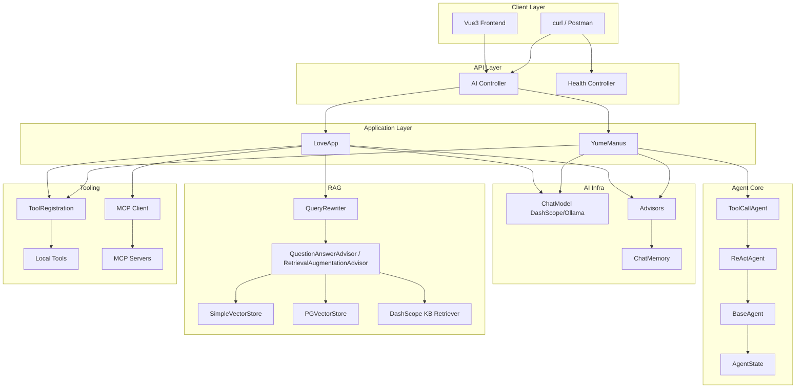
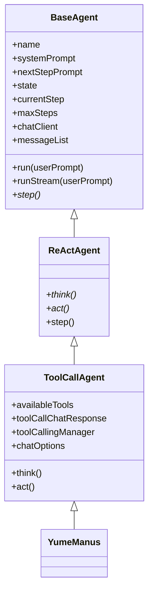
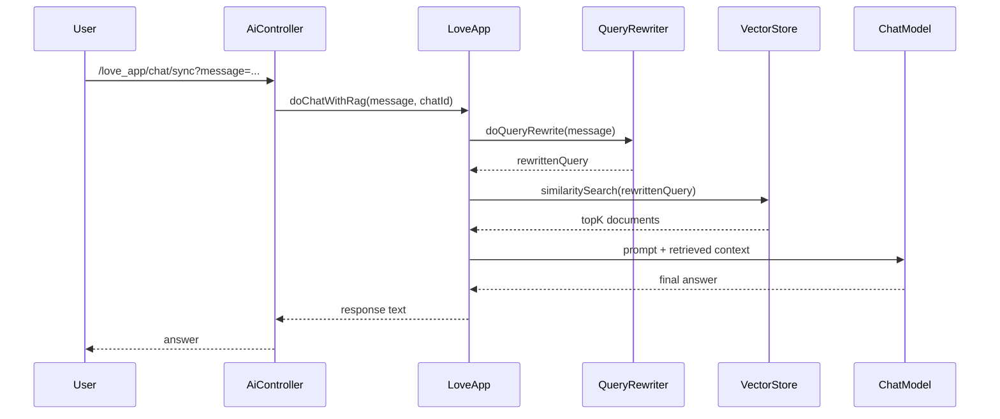
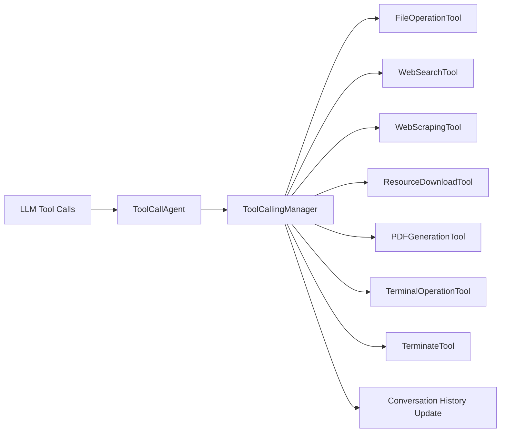
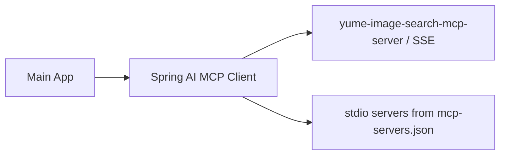
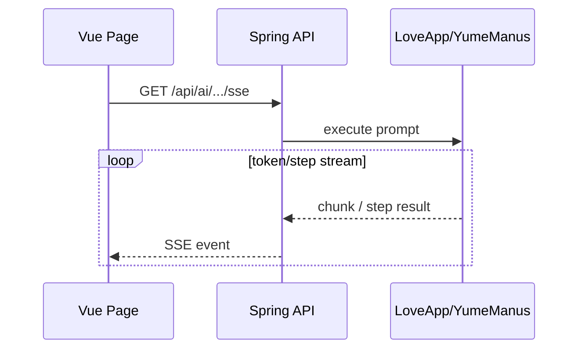

# ARCHITECTURE.md

# Yume AI Agent 架构设计说明

> 本文聚焦系统架构与关键执行链路，覆盖 Agent、RAG、Tool Calling、MCP 的协同方式。

---

## 1. 架构目标

本项目架构设计围绕 4 个目标：

1. **可扩展**：支持从单体工具扩展到外部 MCP 服务。
2. **可演进**：支持从本地向量检索演进到 PGVector / 云知识库。
3. **可观测**：通过 Advisor 日志观察模型输入输出与链路行为。
4. **可演示**：提供前后端可视化交互，便于学习与实习展示。

---

## 2. 分层架构视图

---

## 3. 核心组件设计

## 3.1 接口入口层（Controller）

- `AiController`：对话、SSE、Manus 智能体执行入口。

典型路径：

- `/api/ai/love_app/chat/sse`：恋爱大师流式回复。
- `/api/ai/manus/chat`：超级智能体分步执行。

---

## 3.2 应用编排层（LoveApp / YumeManus）

### LoveApp

负责统一编排：

- 多轮对话
- 结构化输出（LoveReport）
- RAG 增强问答
- 本地工具调用
- MCP 工具调用

### YumeManus

在 `ToolCallAgent` 基础上配置：

- 系统提示词（通用任务执行）
- NextStep 提示词（指导工具规划）
- 最大步数（默认 20）

定位为“可自主规划的多工具 Agent”。

---

## 3.3 Agent 核心抽象

执行逻辑：

1. `think()`：模型判断是否要调用工具以及调用哪些工具。
2. `act()`：执行工具，结果写回会话上下文。
3. 若调用 `doTerminate`，状态切到 `Finished`。

---

## 3.4 Advisor 机制

当前主要包含：

- `MessageChatMemoryAdvisor`：多轮上下文记忆注入
- `MyLoggerAdvisor`：输入输出日志记录
- `ReReadingAdvisor`：可选推理增强（Re-Reading 提示）
- `QuestionAnswerAdvisor`：向量检索增强
- `RetrievalAugmentationAdvisor`：可扩展的 RAG 管线

Advisor 的作用是将“提示词外的能力”模块化插拔，不污染业务代码。

---

## 3.5 RAG 架构

### 数据侧

- 文档目录：`src/main/resources/document/*.md`
- 加载器：`LoveAppDocumentLoader`
- 增强器：`MyKeywordEnricher`
- 切分器：`MyTokenTextSplitter`（预留）

### 检索侧

- Query 改写：`QueryRewriter`
- 检索实现：
  - `SimpleVectorStore`（默认主向量存储）
  - `PgVectorStore`（可切换）
  - DashScope 知识库检索器（云端）

### RAG 流程图

---

## 3.6 Tool Calling 架构

`ToolRegistration` 统一组装工具并注入为 `ToolCallback[]`。

关键点：

- 禁用模型内部工具执行，改为应用侧显式控制。
- 工具执行结果结构化写回上下文，用于下一步决策。

---

## 3.7 MCP 扩展架构

项目内置了 MCP Client，并提供独立 MCP Server 子模块。

### MCP 子模块

- 子项目：`yume-image-search-mcp-server`
- 能力：`ImageSearchTool`（基于 Pexels 图片搜索）
- 支持 profile：`sse` / `stdio`

### MCP 拓扑图

收益：

- 将工具能力服务化；
- 主应用不必内嵌所有工具实现；
- 后续可接入更多第三方 MCP 服务。

---

## 4. 前后端交互架构

前端使用 `EventSource` 直连后端 SSE。

前端通过 Vite 代理 `/api -> http://localhost:8124`，开发体验更顺滑。

---

## 5. 配置与环境隔离

- `application.yml`：主配置（默认 local profile）
- `application-local.yml`：本地开发
- `application-prod.yml`：生产环境
- `mcp-servers.json`：stdio 模式 MCP 服务声明

建议生产使用环境变量注入敏感信息（API Key、数据库账号）。

---

## 6. 部署与运行形态

### 单体运行

- 后端 Spring Boot 单进程运行
- 前端 Vite Dev Server 或静态资源部署

### 容器运行

- Dockerfile 使用 Maven + JDK21 镜像打包运行
- 默认暴露 `8124` 端口

### 服务拆分

- MCP Server 可单独部署并通过 URL 接入

---

## 7. 关键架构取舍

1. **先 SimpleVectorStore，再 PGVector**
   - 先保证可运行、可演示；
   - 再向持久化检索升级。

2. **先本地工具，再 MCP 外挂**
   - 核心能力先落在主工程；
   - 重型或复用型工具逐步外移为 MCP 服务。

3. **显式 ReAct 循环**
   - 学习和控制成本更低；
   - 有利于理解 Agent 内部运行机制。

---

## 8. 后续架构演进建议

- 引入统一 Tool 权限层（按工具、参数、会话做策略控制）
- 增加观察面板（步骤耗时、工具调用次数、失败率）
- 接入重排模型优化 RAG 命中质量
- 增加多 Agent 编排层（Planner / Executor / Critic）
- 将 ChatMemory 改造为 Redis + 长期存储混合记忆

---

## 9. 对应源码定位

- Agent 主干：`src/main/java/com/yume/yumeaiagent/agent/`
- 应用编排：`src/main/java/com/yume/yumeaiagent/app/LoveApp.java`
- RAG 相关：`src/main/java/com/yume/yumeaiagent/rag/`
- 工具注册与实现：`src/main/java/com/yume/yumeaiagent/tools/`
- API 层：`src/main/java/com/yume/yumeaiagent/controller/`
- MCP 子服务：`yume-image-search-mcp-server/src/main/java/`
