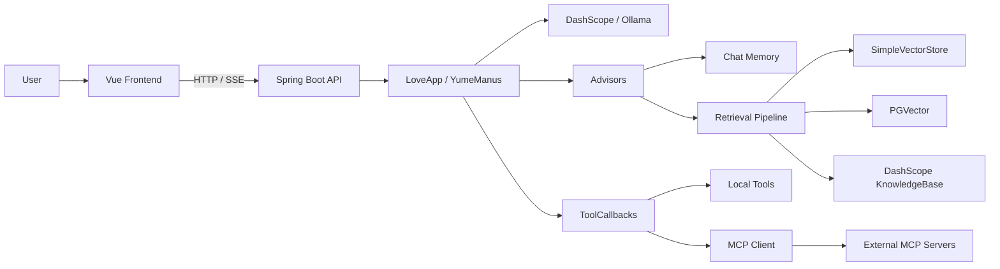

# Yume AI Agent（AI 恋爱大师）

> 基于 **Spring Boot 3 + Spring AI** 的智能体应用项目，聚焦「多轮对话 + 工具调用 + RAG 检索 + MCP 扩展」。

## 目录

- [1. 项目简介](#1-项目简介)
- [2. 核心能力](#2-核心能力)
- [3. 系统架构图](#3-系统架构图)
- [4. 项目结构](#4-项目结构)
- [5. 技术选型与理由](#5-技术选型与理由)
- [6. 工程化实践](#6-工程化实践)
- [7. 快速开始](#7-快速开始)
- [8. 功能入口](#8-功能入口)
- [9. 项目亮点](#9-项目亮点)
- [10. 未来优化方向](#10-未来优化方向)
- [11. 扩展文档](#11-扩展文档)

## 1. 项目简介

**Yume AI Agent** 是一个面向 AI 应用开发的全栈实践项目，定位为：

- **AI 恋爱大师**：面向情感咨询场景的多轮问答应用；
- **通用智能体 YumeManus**：具备分步推理与工具执行能力；
- **可扩展 AI 平台**：支持新工具、新知识库、新 MCP 服务的持续接入。

这个项目的核心目标是把“调用模型”升级为“具备工程能力的 Agent 系统”：

1. 支持多轮上下文记忆；
2. 支持工具调用与多步执行；
3. 支持 RAG 让回答基于知识库；
4. 支持 MCP 让能力可以跨项目扩展。

## 2. 核心能力

### 2.1 Agent 能力

- 支持同步对话与 SSE 流式对话
- 支持 ReAct（Think -> Act）执行循环
- 支持最大步数限制与终止工具
- 支持工具结果回灌上下文形成多步链路

### 2.2 工具生态（可插拔）

当前内置工具：

- `FileOperationTool`：文件读写
- `WebSearchTool`：网页搜索
- `WebScrapingTool`：网页抓取
- `ResourceDownloadTool`：资源下载
- `TerminalOperationTool`：终端命令执行
- `PDFGenerationTool`：PDF 生成
- `TerminateTool`：主动终止任务

工具统一由 `ToolRegistration` 注册，扩展方式清晰。

### 2.3 RAG 知识库能力

- 加载 `src/main/resources/document/*.md` 作为知识源
- 查询改写（`QueryRewriter`）提升召回质量
- 检索增强问答（`QuestionAnswerAdvisor`）
- 支持本地向量存储 / PGVector / 云知识库方案切换

### 2.4 MCP 扩展能力

- 已集成 Spring AI MCP Client
- 支持 `SSE` 与 `stdio` 两种 MCP 接入模式
- 内置独立 MCP 子项目：`yume-image-search-mcp-server`
- 可通过 `mcp-servers.json` 动态接入外部工具服务

### 2.5 前后端联调能力

- 后端：Spring Boot + SSE
- 前端：Vue3 + Vite + Router + Axios
- 页面支持“恋爱大师 / 超级智能体”双入口
- 前端代码由 Cursor 辅助生成并完成整合

## 3. 系统架构图




> 更详细的架构权衡、时序与模块关系见 [ARCHITECTURE.md](./ARCHITECTURE.md)。

## 4. 项目结构

```text
.
├── src/main/java/com/yume/yumeaiagent
│   ├── agent/          # Agent 核心（Base/ReAct/ToolCall/YumeManus）
│   ├── app/            # LoveApp 业务编排
│   ├── controller/     # AI 接口与健康检查
│   ├── advisor/        # 日志/推理增强/检索增强
│   ├── rag/            # 文档加载、改写、向量检索
│   ├── tools/          # 本地工具实现与注册
│   ├── chatmemory/     # 文件记忆实现
│   ├── config/         # CORS 等配置
│   └── constant/       # 常量
│
├── src/main/resources
│   ├── application.yml
│   ├── application-local.yml
│   ├── application-prod.yml
│   ├── mcp-servers.json
│   └── document/*.md
│
├── yume-ai-agent-frontend/           # Vue 前端
├── yume-image-search-mcp-server/     # MCP 子服务（图片搜索）
└── Dockerfile
```

> 详细模块职责见 [MODULES.md](./MODULES.md)。

## 5. 技术选型与理由


| 领域       | 选型                           | 理由                                          |
| -------- | ---------------------------- | ------------------------------------------- |
| Web 框架   | Spring Boot 3                | Java 生态成熟，配置与工程化能力完善                        |
| AI 框架    | Spring AI                    | 统一抽象 ChatModel / Tool / Advisor / RAG / MCP |
| 模型层      | DashScope + Ollama(可选)       | 云端快速落地，本地方案便于实验                             |
| Agent 模式 | ReAct + Tool Calling         | 支持“规划-执行-回写”闭环                              |
| RAG      | 向量检索增强                       | 降低幻觉，提升垂直场景答复准确率                            |
| 向量库      | SimpleVectorStore / PGVector | 本地轻量、线上可持久化升级                               |
| 协议扩展     | MCP                          | 工具服务化、解耦主应用、动态加载能力                          |
| 前端       | Vue3 + Vite                  | 快速实现对话 UI 与流式体验                             |


### 为什么选 Spring AI？

- 对 Java 后端开发者非常友好；
- 同一套范式可覆盖 Prompt、Memory、Tool、RAG、MCP；
- 后续从 Demo 到生产化演进成本更低。

### 为什么引入 PGVector？

- 与 PostgreSQL 生态兼容，部署门槛低；
- 支持持久化与向量检索，适合知识库扩容；
- 与 Spring AI 的向量存储接口对接顺畅。

### MCP 解决了什么问题？

- 避免所有工具强耦合在主工程内；
- 支持跨进程/跨项目复用工具能力；
- 为多 Agent 协作和插件生态预留标准接口。

## 6. 工程化实践

- 分层设计：Controller / App / Agent / RAG / Tools 解耦
- 可观测性：`MyLoggerAdvisor` 记录请求与响应
- 流式交互：`Flux<String>` 与 `SseEmitter` 双实现
- 配置管理：`application.yml + local + prod`
- 服务解耦：MCP 子模块独立运行、独立演进
- 容器化：提供 Dockerfile 支持快速部署
- 前后端联调：Vite 代理 `/api` 到后端 8124

## 7. 快速开始

> 建议先跑通基础对话，再逐步启用 RAG、MCP 与 PGVector。

### 7.1 环境要求

- JDK 21
- Maven 3.9+
- Node.js 18+
- （可选）PostgreSQL + pgvector
- （可选）Ollama

### 7.2 下载项目

```bash
git clone <your-repo-url>
cd yume-ai-agent
```

### 7.3 配置环境变量（推荐）

```bash
export DASHSCOPE_API_KEY="your_dashscope_key"
export SEARCH_API_KEY="your_searchapi_key"
export DB_URL="jdbc:postgresql://localhost:5432/yu_ai_agent"
export DB_USERNAME="postgres"
export DB_PASSWORD="postgres"
export MCP_SERVER_URL="http://localhost:8127"
```

### 7.4 启动后端

```bash
./mvnw clean package -DskipTests
./mvnw spring-boot:run
```

后端地址：

- API: `http://localhost:8124/api`
- Swagger: `http://localhost:8124/api/swagger-ui.html`

### 7.5 启动前端

```bash
cd yume-ai-agent-frontend
npm install
npm run dev
```

前端地址：`http://localhost:5173`

### 7.6 启动 MCP 子服务（可选）

```bash
cd yume-image-search-mcp-server
./mvnw spring-boot:run
```

默认 SSE 端口：`8127`

### 7.7 启用 PGVector（可选）

项目已包含 PGVector 依赖与配置项，启用时请确认：

1. PostgreSQL + pgvector 可用；
2. 数据源配置正确；
3. 根据启动类注释恢复数据库自动配置（用于加载向量存储）。

## 8. 功能入口

### 8.1 恋爱大师

- `GET /api/ai/love_app/chat/sync`
- `GET /api/ai/love_app/chat/sse`

示例：

```bash
curl "http://localhost:8124/api/ai/love_app/chat/sync?message=我最近总是患得患失&chatId=test001"
```

### 8.2 超级智能体

- `GET /api/ai/manus/chat`
- 返回：SSE 分步执行结果

## 9. 项目亮点（实习向）

1. **独立完成端到端 AI 应用**：后端、前端、模型接入、RAG、工具生态。
2. **真正理解 Agent 原理**：实现了状态机、步骤循环、工具回写上下文。
3. **可插拔扩展能力**：本地工具 + MCP 外部服务并存。
4. **掌握 RAG 全流程**：文档加载、查询改写、向量检索、上下文增强。
5. **具备工程化思维**：配置分层、流式接口、容器化、API 文档化。

## 10. 未来优化方向

- 增加更多工具：日程、情绪、画像、知识订阅
- 支持多 Agent 协作：Planner / Executor / Critic
- 检索优化：混合检索、重排模型、路由策略
- 安全增强：工具权限隔离、命令白名单
- 观测体系：RAG 命中率、工具成功率、延迟与成本监控
- 生产化部署：容器编排、灰度发布、告警链路

## 11. 扩展文档

- 架构详解：`[ARCHITECTURE.md](./ARCHITECTURE.md)`
- 模块清单：`[MODULES.md](./MODULES.md)`

## License

用于学习与交流，欢迎二次开发与改进。